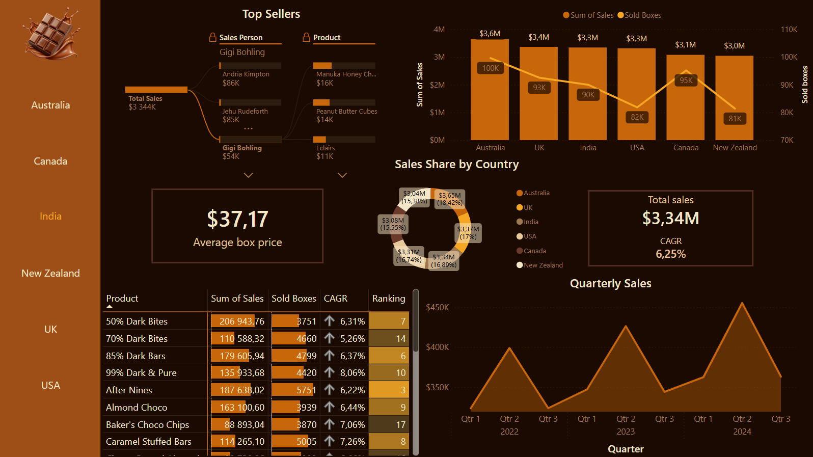
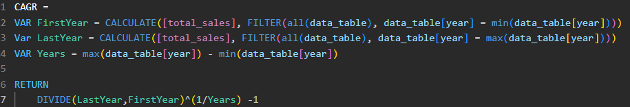
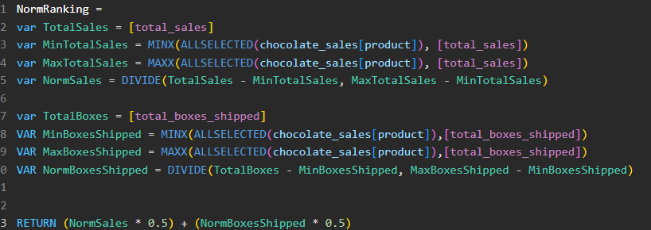
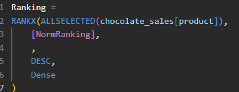

# Chocolate Sales Dashboard

## Data Source  https://www.kaggle.com/datasets/saidaminsaidaxmadov/chocolate-sales?select=Chocolate+Sales+%282%29.csv

This project presents a sales analysis dashboard created in Power BI for a chocolate sales dataset. The goal of the project was to explore sales performance across countries, products, salespeople, and time periods

Dataset was cleaned and prepared before building dashboard. Data transformation and basic preparation were done in Postgresql and Visial Studio Code. Final anaylysis was created in PowerBI

# Dashboard

## The dashboard includes:
- Total sales overview
- Sales by country
- Sales by quarter
- Top-sellings products
- Sales breakdown by salesperson
- Key KPI cards such as CAGR and average box price

- Product Ranking

## Tools
`Power BI` `DAX` `Power Query` `Postgresql` `csv dataset`
